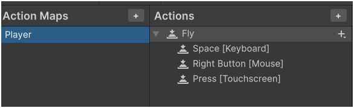
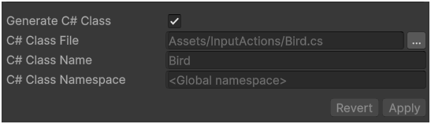
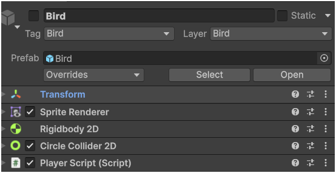
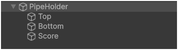
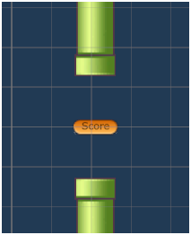
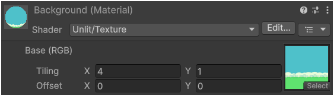
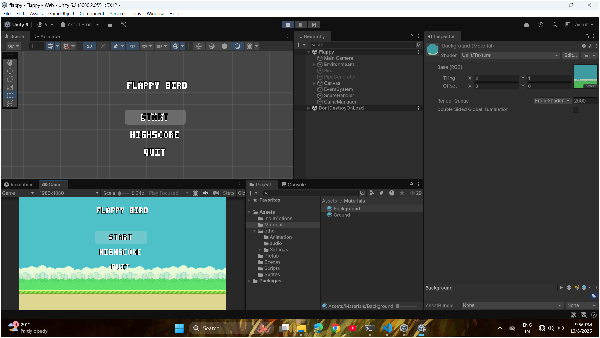

# Flappy Bird Clone (Unity)

A simple clone of the classic Flappy Bird made in Unity using C#.

##  Play Now
 [Play on Itch.io](https://vignesh53612gmailcom.itch.io/flappybird)

##  Built With
- Unity 6
- C#
- 2D Physics, Colliders, and UI

##  Features
- Tap/Click to fly mechanics
- Randomized pipe generation
- Scoring system
- Game Over and Restart logic
- Pause/Resume functionality
- WebGL build playable online


##  What I Learned
- Implementing Unity physics & collision detection  
- Using prefabs & layers effectively  
- UI score updates and time scaling  

##  Future Improvements
- Add background music & sound effects  
- Improve visuals with animations  
- Add difficulty levels  
- Add a leaderboard or high score system  

## Script Overview 
### 1. Creating  Input-Action & Generating script
!

#
### 2. Creating the player
1. Create gameObject 2d->circle
2. Change the sprite 
3. Add components (Rigidbody2D,circleCollider2D)
4. Add player Player script



    Description :
    
        Bird bird;
        bird = new Bird(); //assigning or grabbing
        bird.Player.Fly.performed += OnFly; //subscribe
#
### 3. Generating  Pipes
1. create a pipeHolder emptyObject that hold (Top / Bottom pipe) also add the score empty object as same as player



2. Add box collider for pipe and score for box collider keep trigger = true

3. Add pipe script for pipeHolder to move
```
    //moving the pipes left side
       transform.Translate(Vector2.left * speed * Time.deltaTime);
```
4. Make it as prefab to generate later
#
### GameOver
when player hit the pipe or ground game need to stop or restart
1. using the unity built-in function
 ```
    [SerializeField] LayerMask birdLayer;  
    void OnCollisionEnter2D(Collision2D other)
    {
        if (((1 << other.gameObject.layer) & birdLayer) != 0)
        {
            //gameOver            
            
        }
    }
```
2. we used the layermask above method and there is also other way using **Tag**
```
        if(other.gameObject.Tag("Bird)){
            //gameOver
        }
 ```

3. attach this script to out **Top-bottom** object in pipeHolder and also add to **Ground**

#
### Score updating
1. create a emptyGameObject named as score add circleCollider2D(istrigger = true)
2. creating the object between the pipes



```c
    //singleton 
    public class ScoreHandler : MonoBehaviour  {
    
    public static ScoreHandler instance;
    void Awake()
    {
        if (instance != null) Destroy(this);
        instance = this;
    }
    }

    //collision detection by layer
    public class Score : MonoBehaviour
    {
    void OnTriggerEnter2D(Collider2D collision)
    {
        if(((1 << collision.gameObject.layer) & birdLayer) != 0)
        {
            //increase the score
            ScoreHandler.instance.IncrementScore(1);
        }
    }
    }
```
#
### Background and Ground 
1. make a 3d->Quard and add our material
2. How to make material
```
    1 => Right-click on project window
    2 => create -> material
```
3. perform this operation given below
```
    in shader select
    unlit->texture
```


4. use tilling parameter you tail your image
5. drag the material and put in background quard object

#
### GameManger
1. It handel the game scores when restart
```
    public void ResetScore()
    {
        score = 0;
    }
```
2. Pause & Resume by using timescale
```
    public void PauseGame(){
        Time.timeScale = 0.0f;
    }
    public void ResumeGame(){
        Time.timeScale = 1.0f;
    }

```
3. update the uiText
```
    using UnityEngine.UI;
    public Text uiScoreText;
    void UpdateUiScore()
    {
        scoreText.text = score.ToString(); //score var don't consider it just example
    }
```
4. And there is some sort other feature in GameManger . Refer the script as load in github

#
### Output 

